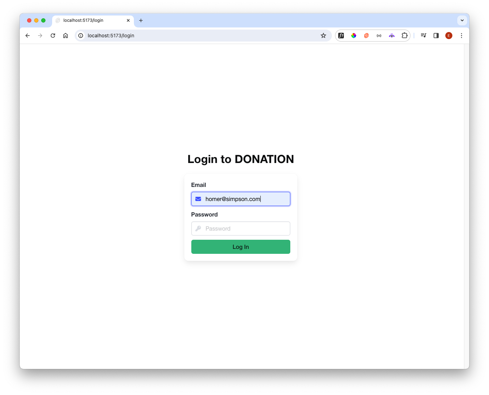
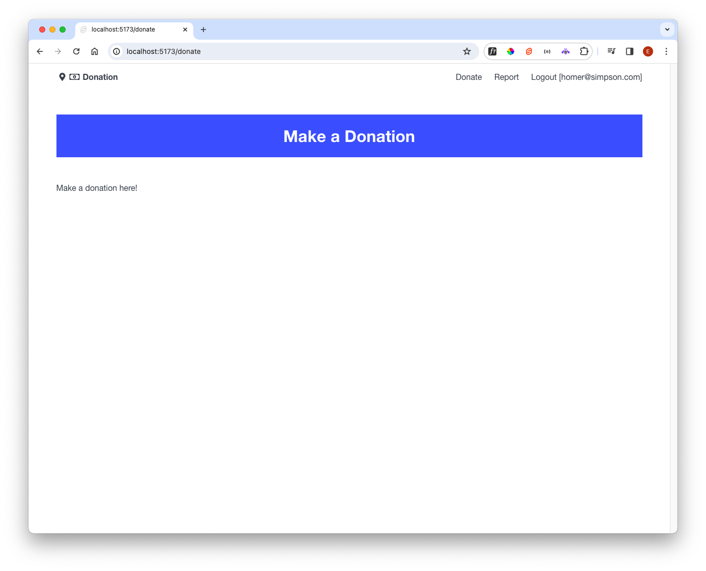

# Heading + Menu Components

Introduce 2 new components:

### src/lib/ui/Heading.svelte

~~~html

<section class="hero is-link is-small mt-6 mb-6">
  

    

      <h1 class="title has-text-centered">
        {$subTitle}
      </h1>
    

  

</section>
~~~

### src/lib/ui/Menu.svelte

~~~html

<nav class="navbar is-full-width">
  

    

      <a class="navbar-item" href="/dashboard">
         <i class="fas fa-map-marker-alt"></i> 
          <i class="far fa-money-bill-alt"></i><strong>Donation</strong>
          
      </a>
    

    

      

        <a class="navbar-item" href="/donate"> Donate </a>
        <a class="navbar-item" href="/report"> Report </a>
        <a class="navbar-item" href="/logout"> Logout [{$currentSession}]</a>
      

      

    

  

</nav>
~~~

These components define a menu + a heading we would like to use for all logged in users. Notice that both of them use the stores - prefixed with `$`.

For instance, loggedInUser is imported in the `

  {#if $currentSession}
    <Menu />
    <Heading />
  {/if}
  <slot />

~~~

Create a new show this layout in action

### src/routes/donate/+page.svelte

~~~html

  Make a donation here!

~~~

To test this out, make a change to LoginForm:

### src/routes/login/LoginForm.svelte

Force success to be `true`, and set the `currentSession` value:

~~~html

//...
~~~

Running this now we can exercise the `/donate` route. Press login below (make sure to enter a value in email):

... the `goto` function will navigate to this route:

