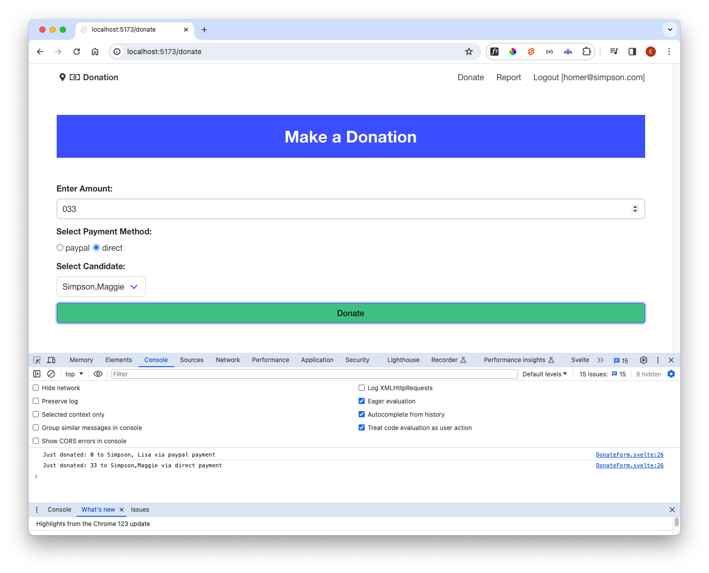

### Donate Form

This is a simple form we would like to create:

Create a new component to scaffold our this form. First, the skeleton

### src/routes/donate/DonateForm.svelte

~~~html

<form></form>
~~~

Svelte 'hot loads' any changes, so we can start to see the form taking shape as we save updates to the form. First, place it on the Donate view:

### src/routes/donate/+page.svelte

~~~html

<DonateForm />
~~~

Now insert the html element we need in the form:

### src/routes/donate/DonateForm.svelte

~~~html

<form>
  

    <label class="label" for="amount">Enter Amount:</label>
    <input class="input" id="amount" name="amount" type="number" />
  

  

    

      <label class="label" for="amount">Select Payment Method:</label>
      <input class="radio" type="radio" /> paypal
      <input class="radio" type="radio" /> direct
    

  

  

    <label class="label" for="amount">Select Candidate:</label>
    

      <select>
        <option>Simpson, Lisa</option>
        <option>Simpson, Maggie</option>
        <option>Flanders, Ned</option>
      </select>
    

  

  

    

      <button class="button is-success is-fullwidth">Donate</button>
    

  

</form>

~~~

The form should now appear (without needing any refresh, triggered by saving the DonateForm component:

The form is static - its values are hard coded. Here is a update that binds all the values (like payment methods, candidates) to variables:

~~~html

<form on:submit|preventDefault={donate}>
  

    <label class="label" for="amount">Enter Amount:</label>
    <input bind:value={amount} class="input" id="amount" name="amount" type="number" />
  

  

    

      <label class="label" for="amount">Select Payment Method:</label>
      {#each paymentMethods as method}
        <input bind:group={selectedMethod} class="radio" type="radio" value={method} /> {method}
      {/each}
    

  

  

    <label class="label" for="amount">Select Candidate:</label>
    

      <select bind:value={selectedCandidate}>
        {#each candidateList as candidate}
          <option>{candidate.lastName},{candidate.firstName}</option>
        {/each}
      </select>
    

  

  

    

      <button class="button is-success is-fullwidth">Donate</button>
    

  

</form>
~~~

If we try this out, and inspect the console, we can see the values flowing through the variables:

