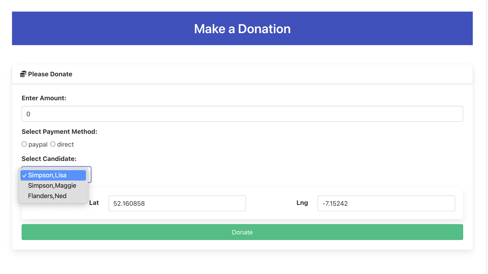

# Donation Svelte: Candidate List

When the application starts up - we first need to request the latest candidate list from the server. On place to do is the +page.ts file for the donate route:

### src/routes/donate/+page.ts

~~~typescript
import { donationService } from "$lib/services/donation-service";

export const load = async () => {
  return {
    candidateList: await donationService.getCandidates()
  };
};
~~~

The load function above will be invoked when this route is visited. It has one task, request any additional resources the page.svelte will need. This is packaged into an object and returned as the result of the load function.

This returned object is made available as an object called `data` in the matching page.svelte file:

### src/routes/donate/+page.svelte

~~~typescript

<Menu />
<Heading title="Make a Donation" />
<Card title="Please Donate">
  <DonateForm candidateList={data.candidateList} />
</Card>
~~~

In the above, we are passing this immediately to the `DonateFrom` component above.

This is our current DonateForm:

### Src/lib/ui/DonateForm

~~~typescript

<form on:submit|preventDefault={donate}>
  

    <label class="label" for="amount">Enter Amount:</label>
    <input bind:value={amount} class="input" id="amount" name="amount" type="number" />
  

  

    

      <label class="label" for="amount">Select Payment Method:</label>
      {#each paymentMethods as method}
        <input bind:group={selectedMethod} class="radio" type="radio" value={method} /> {method}
      {/each}
    

  

  

    <label class="label" for="amount">Select Candidate:</label>
    

      <select bind:value={selectedCandidate}>
        {#each candidateList as candidate}
          <option>{candidate.lastName},{candidate.firstName}</option>
        {/each}
      </select>
    

  

  <Coordinates bind:lat bind:lng />
  

    

      <button class="button is-success is-fullwidth">Donate</button>
    

  

</form>
~~~

In the above we have some hard coded candidates. We can now remove these, and expect the candidateList to be passed into the component:

~~~typescript
  //...
  import type { Candidate } from "$lib/services/donation-types";

  // const candidateList = [
  //   {
  //     firstName: "Lisa",
  //     lastName: "Simpson",
  //     office: "President"
  //   },
  //   {
  //     firstName: "Maggie",
  //     lastName: "Simpson",
  //     office: "President"
  //   },
  //   {
  //     firstName: "Ned",
  //     lastName: "Flanders",
  //     office: "President"
  //   }
  // ];
  
  export let candidateList: Candidate[] = [];
~~~

First we import the Candidate type. Then, the `export` declares that this object (an array of Candidates) must be provided as the component is created

Recall, this is how we are creating the `DonateForm`:

~~~typescript
  <DonateForm candidateList={data.candidateList} />
~~~

Try the app now. We are not supporting donation yet, but the latest candidate list should appear in the drop down on the form:

