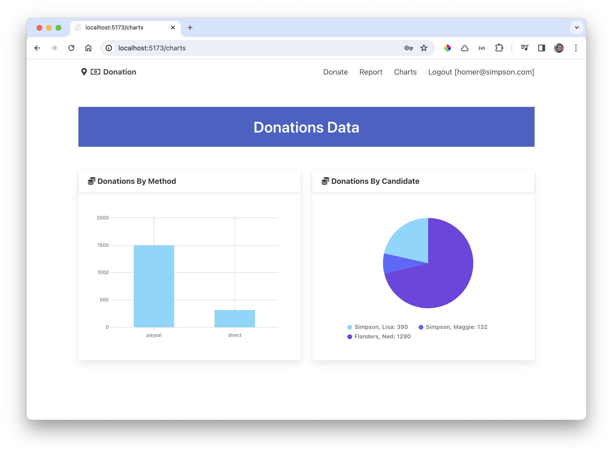

# Donations by Candidate

Lets making the charts show different data:

- Payment Methods  - this is completed.
- Donations per Candidate - todo

Introduce a new data series;

### src/routes/charts/+page.ts

~~~typescript
const donationsByCandidate = {
  labels: [],
  datasets: [
    {
      values: [0, 0]
    }
  ]
};
~~~

In the load function, initialise the labels + return this new data series (donaionsByCandidate):

~~~javascript
export const load = async () => {
  donationService.checkPageRefresh();
  const donationList = await donationService.getDonations();
  donationList.forEach((donation) => {
    if (donation.method == "paypal") {
      donationsByMethod.datasets[0].values[0] += donation.amount;
    } else if (donation.method == "direct") {
      donationsByMethod.datasets[0].values[1] += donation.amount;
    }
  });
  const candidates = await donationService.getCandidates();
  donationsByCandidate.labels = [];
  candidates.forEach((candidate) => {
    donationsByCandidate.labels.push(`${candidate.lastName}, ${candidate.firstName}`);
    donationsByCandidate.datasets[0].values.push(0);
  });

  return {
    byMethod: donationsByMethod,
    byCandidate: donationsByCandidate
  };
};
~~~

Change the pie chart to display the donationsByCandidate:

### src/routes/charts/+page.svelte

~~~html
      <Chart data={data.byCandidate} type="pie" />
~~~

No data displayed yet in the second chart - just the candidate names. Append this to load to harvest the donations data:

~~~javascript
//...
    candidates.forEach((candidate, i) => {
    donationList.forEach((donation) => {
      if (donation.candidate._id == candidate._id) {
        donationsByCandidate.datasets[0].values[i] += donation.amount;
      }
    });
  });
//...
~~~

This is the complete charts route at this stage:

### src/routes/charts/+page.ts

~~~typescript
import { donationService } from "$lib/services/donation-service";
export const ssr = false;

const donationsByMethod = {
  labels: ["paypal", "direct"],
  datasets: [
    {
      values: [0, 0]
    }
  ]
};

const donationsByCandidate = {
  labels: [],
  datasets: [
    {
      values: [0, 0]
    }
  ]
};

export const load = async () => {
  donationService.checkPageRefresh();
  const donationList = await donationService.getDonations();
  donationList.forEach((donation) => {
    if (donation.method == "paypal") {
      donationsByMethod.datasets[0].values[0] += donation.amount;
    } else if (donation.method == "direct") {
      donationsByMethod.datasets[0].values[1] += donation.amount;
    }
  });

  const candidates = await donationService.getCandidates();
  donationsByCandidate.labels = [];
  candidates.forEach((candidate) => {
    donationsByCandidate.labels.push(`${candidate.lastName}, ${candidate.firstName}`);
    donationsByCandidate.datasets[0].values.push(0);
  });

  candidates.forEach((candidate, i) => {
    donationList.forEach((donation) => {
      if (donation.candidate._id == candidate._id) {
        donationsByCandidate.datasets[0].values[i] += donation.amount;
      }
    });
  });

  return {
    byMethod: donationsByMethod,
    byCandidate: donationsByCandidate
  };
};
~~~

### src/routes/charts/+page.svelte

~~~javascript

<Menu />
<Heading title="Donations Data" />

  

    <Card title="Donations By Method">
      <Chart data={data.byMethod} type="bar" />
    </Card>
  

  

    <Card title="Donations By Candidate">
      <Chart data={data.byCandidate} type="pie" />
    </Card>
  

~~~

It should work as before, but is easier to reason with
