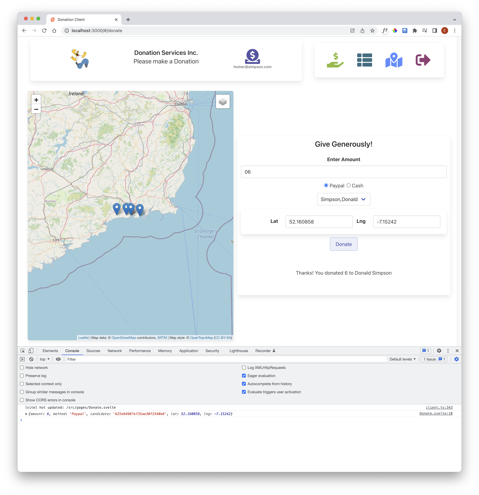

## Donation Store 

The issue with the last step is that, when we make a donation, the Map component was not alerted to this event, and so did not redraw itself.

One solution to this is to create a Svelte store that contains the latest donation made. We define this in store.js, where we already have a user store;

### stores.js

~~~javascript
import { writable } from "svelte/store";

export const user = writable({
	email: "",
	token: ""
});

export const latestDonation = writable(null);
~~~

Every time a donation is made we can write the new donation to this store:

### services/donation-service.js

~~~javascript
import { latestDonation, user } from "../stores";
...
...
	async donate(donation) {
		try {
			const response = await axios.post(this.baseUrl + "/api/candidates/" + donation.candidate + "/donations", donation);
			latestDonation.set(donation);
			return response.status == 200;
		} catch (error) {
			return false;
		}
	},
...
~~~

The map component can listen for updates to this store, and populate the markers:

~~~javascript
	latestDonation.subscribe((donation) => {
		if (donation && map) {
			addDonationMarker(map, donation);
		}
	});
~~~

This is the complete component, we have promoted the `map` component to be available to all methods by declaring it as a variable outside any function scope:

### lib/DonationMap.svelte

~~~html

~~~

Making a donation now should cause it to appear immediately:

We can further refine the to make an additional call - **map.moveTo** will zoom into each marker as they are added:

~~~javascript
	function addDonationMarker(map, donation) {
		const donationStr = `${donation.candidate.firstName} ${donation.candidate.lastName} €${donation.amount.toString()}`;
		map.addMarker({ lat: donation.lat, lng: donation.lng }, donationStr, "Donations");
		map.moveTo(8, { lat: donation.lat, lng: donation.lng });
	}
~~~

Try this now and you should see the map centre on each donation location as it is added.
