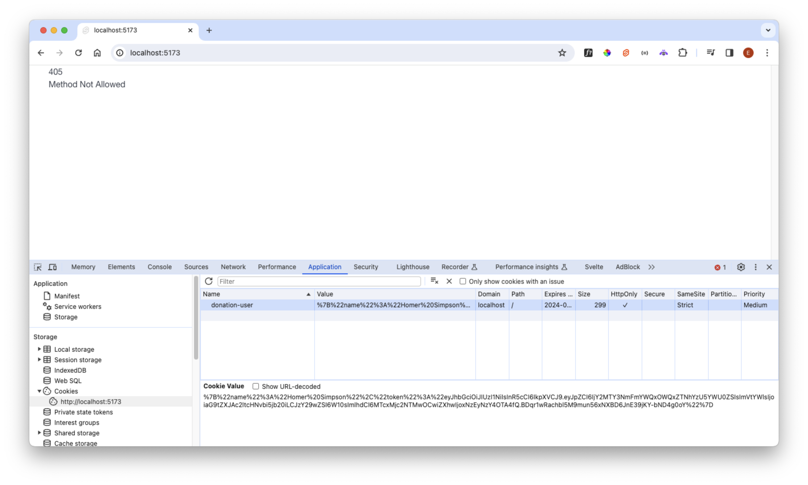

# Login

In SvelteKit, the structure of a components name can be used to specify whether the code contained therein should be run on the server as opposed to being bundled and downloaded to the client (browser). This is a challenged concept to master and many of the frameworks are still evolved a coherent approach.

Let's dive in. We start with the Login form. This is currently implemented as a svelte component:

### src/routes/login/LoginForm.svelte

~~~svelte

{#if message}
  <Message {message} />
{/if}
<form on:submit|preventDefault={login}>
  <UserCredentials bind:email bind:password />
  <button class="button is-success is-fullwidth">Log In</button>
</form>
~~~

The login function is, of course, running in the browser. We could rewrite this component as follows:

~~~svelte

{#if message}
  <Message {message} />
{/if}
<form method="POST" action="?/login">
  <UserCredentials />
  <button class="button is-success is-fullwidth">Log In</button>
</form>
~~~

We have removed login function, and refactored the form to use a conventional `POST` method. I.e. it is like a form we would have developed in a Hapi application. In Hapi, the from action will ultimately lead to a server route + controller. In SvelteKit, the equivalent is a server component - running (like the Hapi controllers) on the server.

In SvelteKit, the equivalent role to a controller is played by a sever component - denoted by the word `server` in the file name of the component. Create a new file for this now:

### src/routes/login/+page.server.ts

~~~typescript
import { redirect } from "@sveltejs/kit";

export const actions = {
  login: async ({ request }) => {
    const form = await request.formData();
    const email = form.get("email") as string;
    const password = form.get("password") as string;
    if (email === "" || password === "") {
      throw redirect(307, "/");
    } else {
      console.log(`attemting to log in email: ${email} with password: ${password}`);
    }
  }
};
~~~

This is the login action (a controller method) that will be invoked when the user presses the Login button. If you try this now it will not work successfully yet, however the console.log statement will run. However, you will see the log statement:

~~~bash
attemting to log in email: homer@simpson.com with password: secret
~~~

... not in the browser console, but in the terminal you used to launch the application. I.e. this code is running on the server!

This is a more complete version - which will invoke the donationService.login() method and store the session in a conventional cookie.

~~~typescript
import { dev } from "$app/environment";
import { donationService } from "$lib/services/donation-service";
import { currentSession } from "$lib/stores.js";
import { redirect } from "@sveltejs/kit";

export const actions = {
  login: async ({ request, cookies }) => {
    const form = await request.formData();
    const email = form.get("email") as string;
    const password = form.get("password") as string;
    if (email === "" || password === "") {
      throw redirect(307, "/");
    } else {
      console.log(`attemting to log in email: ${email} with password: ${password}`);
      const session = await donationService.login(email, password);

      if (session) {
        currentSession.set(session);
        const userJson = JSON.stringify(session);
        cookies.set("donation-user", userJson, {
          path: "/",
          httpOnly: true,
          sameSite: "strict",
          secure: !dev,
          maxAge: 60 * 60 * 24 * 7 // one week
        });
        throw redirect(303, "/donate");
      } else {
        throw redirect(307, "/");
      }
    }
  }
};
~~~

The cookie interface is passed as a parameter to the login function - and we store the session there.

Although the app does not function yet, you should be able to see the cookie being successfully created:

